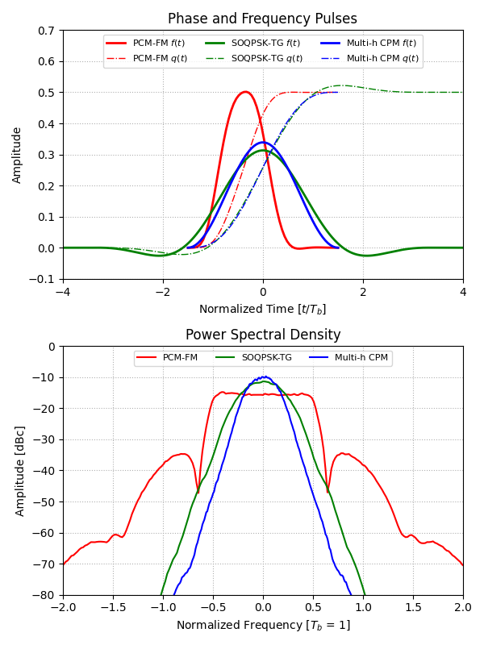

# waveforms

This repository will serve as a collection of notes, simulations, and experiments for various different modulations at the waveform level.
With respect to the OSI model, this will be primarily focused on layer 1, with some coverage of layer 2 for improving link margin and quality of service.

## Topics
The plan is to explore all of the following concepts in this repository:
- RF Basics
  - Link budgets
  - Transmitter and receiver systems
  - Polarizaion
  - Antennas
- Common RF Plots
  - Power Spectral Density (PSD)
  - Eye Diagram
  - Constellation
  - Modulation performance curve
- Digital Signal Processing Concepts
  - S-domain
  - Z-domain
  - Continuous to discrete time mathematics
  - Finite Impulse Response (FIR) Filters
  - Infinite Impulse Response (IIR) Filter
  - Feild Programmable Gate Arrays (FPGAs)
- Modulation Techniques
  - Amplitude Modulation (AM)
  - Frequency Modulation (PM)
  - Phase Modulation (PM)
  - Frequency Shift Keying (FSK)
  - Phase Shift Keying (PSK)
  - Continuous Phase Modulation (CPM) ✔️
  - Continuous Phase Frequency Shift Keying (CPFSK)
  - Quadrature Amplitude Modulation (QAM)
  - Orthogonal Frequency Division Multiplexing (OFDM)
- Demodulation & Detection
  - Theoretical detection efficiency
  - Matched filters (MF)
  - Trellis/viterbi demodulation
  - Timing error detectors (TEDs)
  - Phase error detectors (PEDs)
  - Adaptive equalization
- Foreward Error Correction (FEC)
- Standards
  - IRIG106 ✔️
  - CCSDS

## Repository Structure

The folowing table describes the repository structure.
| Directory | Purpose |
| --- | --- |
| [notes/](./notes/) | Notes for each of the aforementioned topics.  Currently in Markdown, but deploying as a website makes sense long term. |
| [waveforms/](./waveforms/) | Python module used to implement concepts from notes. |
| [examples/](./examples/)   | Scripts used to simulate concepts from notes using the waveforms module. |
| [images/](./images/)   | Plotted outputs from examples, used in notes. |

## Preview - CPM Waveforms Defined in IRIG106

We'll start by looking at the continuous phase modulation (CPM) waveforms defined in the IRIG106 [[1]][irig106-22] set of standards, since they are standardized in the aeronautical telemetry industry for both their spectral efficiency detection efficiency.

Below is a simulation of the waveforms specified in IRIG106, using notes and code contained in this repository.

## References

[[1]][irig106-22]
IRIG Standard 106-22.

[[2]][reduced-cpm]
Reduced Complexity Detection Methods for Continuous Phase Modulation.

[[3]][fpga-soqpsk]
A Hardware Implementation of a Coherent SOQPSK-TG Demodulator for FEC Applications.

<!-- Reference links -->

[reduced-cpm]: https://scholarsarchive.byu.edu/cgi/viewcontent.cgi?article=1619&context=etd
[fpga-soqpsk]: https://core.ac.uk/download/pdf/213394311.pdf
[irig106-22]: https://www.irig106.org/docs/106-22/106-22_Telemetry_Standards.pdf