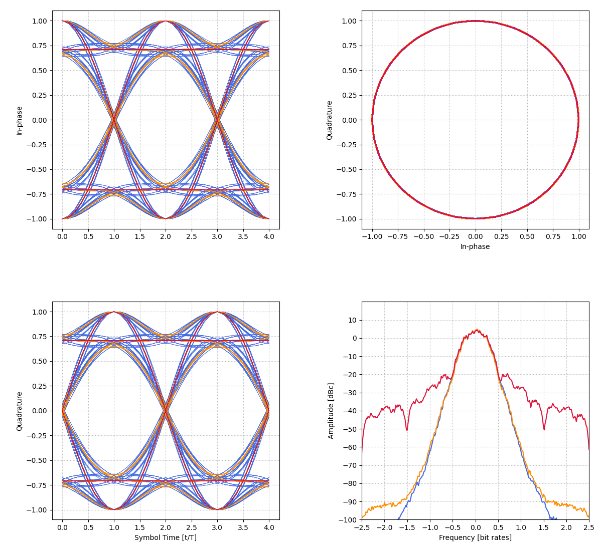

# Shaped-Offset Quadrature Phase-Shift Keying

Here we will take a brief look at a ternary family of CPM known as Shaped-Offset Quadrature Phase-Shift Keying (SOQPSK).

## Bit to Symbol Precoder
The symbol precoder can be described with the following recursive expression

$$
\alpha_i = (-1)^{i+1}(2b_{i-1}-1)(b_{i}-b_{i-2})
$$

However, the SOQPSK precoder is often represented as a mapping table or trellis to better illustrate the reverse process of mapping symbols to bits.
This definition actually makes SOQPSK seem more like a binary waveform with memory. 
A -1 cannot be followed by a +1, and vice-versa, so the symbol $\alpha_i$ is actually drawn from two binary alphabets.
For this reason, SOQPSK is sometimes referred to as a duo-binary CPM, a definition that comes in useful for certain receiver implementations.

## Frequency Pulses

We will look at two different frequency pulse definitions that can be used to describe four variants of SOQPSK: MIL-STD, A, B, and TG.

The first of these frequency pulses is used to describe the full-response SOQPSK-MIL modulation.
$f_{MIL}(t)$, can be described with the following table

| $f_{MIL}(t)$ | Case |
| ---- | ------ |
| $\frac{1}{2T}$ | $0 \le t \lt T$ |
| 0 | otherwise|

The second frequency pulse definition describe the partial-response SOQPSK-A, SOQPSK-B, and SOQPSK-TG modulation variants.
We'll denote this as $f_{SOQPSK}(\tau)$, with expression

$$
f_{SOQPSK}(\tau) = A\frac{cos(\pi \rho B \tau)}{1-4(\rho B \tau)^2}
\times
\frac{\sin({\pi B \tau})}{\pi B\tau}
\times w(\tau)
$$

where windowing function $w(\tau)$ is

| $w(\tau)$ | Case |
| ---- | ------ |
| 1    | $0 \le \vert \tau \vert \lt T_1$ |
| $\frac{1}{2} + \frac{1}{2} \cos \left( \frac{\pi}{T_2} (\tau - T_1 ) \right)$ | $T_1 \le \vert \tau \vert \le T_1 + T_2$ |
| 0    | $T_1 + T_2 \lt \vert \tau \vert$ |

The substitution of $\tau = t/2T$ has been used to simplify the above expressions.
It appears that $f_{SOQPSK}(\tau)$ can also be used to describe SOQPSK-MIL in the special case where $T_1 = 1/4$, $T_2 = 0$, and $B = 0$, the expression might require further manipulation however.
The constants used in the description of SOQPSK have values summarized below [[1]][soqpsk-itc].

| Constant | SOQPSK-A | SOQPSK-B | SOQPSK-TG | SOQPSK-MIL |
| -------- | ---- | ---- | ---- | ---- |
| $B$      | 1.35 | 1.45 | 1.25 |  0    |
| $T_1$    | 1.4  | 2.8  | 1.5  |  0.25 |
| $T_2$    | 0.6  | 1.2  | 0.5  |  0    |
| $\rho$   | 1.0  | 0.5  | 0.7  |  0    |

$A$ is not described in the table, as in literature it specifies that $A$ is set such that the the integral of the frequency pulse is 1/2. 
This is likely for the discrete mathematical implementation of SOQPSK transmitters and receivers on FPGAs.

## SOQPSK Variant Comparison
The following plot has been generated through a simulation that can be found in [examples/soqpsk_example.py](../examples/soqpsk_example.py).
8 samples per symbol were used, and random data was modulated.

SOQPSK-TG, SOQPSK-A, and SOQPSK-MIL have their eye-diagrams, constellations, and power spectral density (PSD) plotted in blue, orange, and red respectively.
We can see that the full-response nature of SOQPSK-MIL (first described in the 1980's) gives it a very simple eye-diagram.
The partial-response nature of SOQPSK-A and SOQPSK-TG can be seen, with different paths between key points on the eye-diagram.
The biggest difference can be seen when looking at spectral efficiency.
SOQPSK-A and SOQPSK-TG's enhanced pulse shaping suppresses out-of-band emissions by many orders of magnitude when compared to SOQPSK-MIL.
SOQPSK-TG was adopted by the IRIG106 set of standards for its incredible spectral efficiency, and superior detection efficiency when compared to SOQPSK-A.

## References

[[1]][soqpsk-itc]
AN ENHANCED, CONSTANT ENVELOPE, INTEROPERABLE SHAPED OFFSET QPSK (SOQPSK) WAVEFORM FOR IMPROVED SPECTRAL EFFICIENCY

[soqpsk-itc]: https://www.quasonix.com/files/soqpsk-itc-paper.pdf
